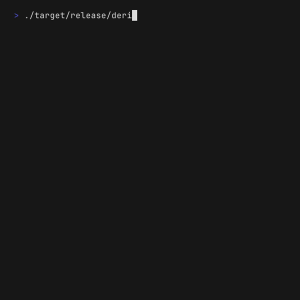
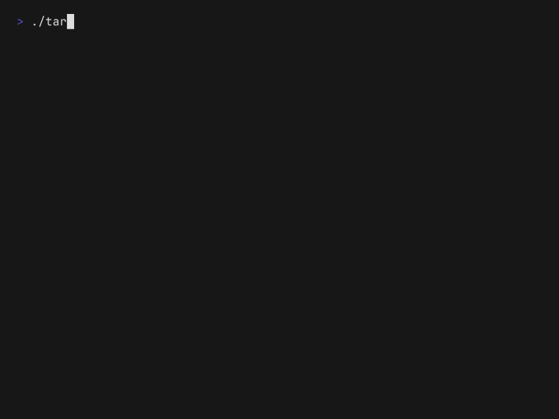

# DERIVA
 
[🇧🇷 Português](README.md) | 🇺🇸 English
 
[](https://github.com/igorgbr/deriva/actions/workflows/ci.yml) [](https://crates.io/crates/deriva) [](LICENSE)
 
Terminal visual novel in Rust. Colored ASCII art, truecolor gradients,
mouse support, and stories anyone can write in a .txt file.
 

 
## Install
 
```bash
cargo install deriva                    # from crates.io
cargo install deriva --features sound   # with sound (needs ALSA headers on Linux)
```
 
Or grab a prebuilt binary (Linux, macOS, Windows) or the `.deb` from the
[releases page](https://github.com/igorgbr/deriva/releases).
On Arch: the `deriva` package on the AUR.
 
## Run
 
```bash
cargo run              # builds anywhere, no system dependencies
 
# Commodore 64 look (blue background, border, light blue text):
cargo run -- --c64
```
 

 
Sound (sine tones via rodio) is **opt-in**, so `cargo install` never
fails for missing audio headers. Without the feature, sound effects
fall back to the terminal BEL:
 
```bash
# on Linux, you need the ALSA headers (one time only):
sudo dnf install alsa-lib-devel      # Fedora
sudo apt install libasound2-dev      # Debian/Ubuntu
 
cargo run --features sound
```
 
## External stories
 
The bundled story is just a starting point — any .txt in the format
below is playable, no recompiling:
 
```bash
deriva my-story.txt            # play your own story
deriva --check my-story.txt    # validate without playing (for authors)
deriva --help
```
 
`--c64` mode uses OSC 10/11 to swap the terminal's default colors
(restored on exit); terminals without support ignore the codes and
show only the border.
 
## Test story consistency
 
```bash
cargo test
```
 
Fails if any scene points to a nonexistent target or is a dead end.
 
## Writing stories
 
Edit `assets/story.txt` (the bundled one) or create your own .txt. Format:
 
```
=== scene_id
@art
  (optional ascii art, in cyan)
@text
Narrative text (typewriter effect).
@choices
Choice label -> target_scene_id
Another choice -> another_id
```
 
Ending scene: replace `@choices` with `@ending good` or `@ending bad`.
 
The starting scene must be named `inicio`.
 
Colors (work in both `@art` and `@text`): `{c}` cyan, `{y}` yellow,
`{g}` green, `{r}` red, `{m}` magenta, `{w}` white, `{0}` default.
Art starts in cyan by default — use `{c}` to go back to it.
 
Vertical gradient (truecolor): `@art #RRGGBB #RRGGBB` — interpolates
from top to bottom, e.g. `@art #5fd7ff #ff5fd7`. Inline tags override
the gradient until the end of the line, so prefer one or the other per scene.
 
## Controls
 
Click a choice with the mouse, or press its number (no Enter).
`q` / `Esc` quits at any time.
 
External stories are validated on load; the bundled one requires
recompiling after you edit it.
 
The bundled story is written in Portuguese.
 
## Future ideas
 
- Inventory/flags (e.g. the reactor only opens if you have the Cactus)
- A `~/.config/deriva/stories/` folder with a menu of installed stories
- Save progress to a file